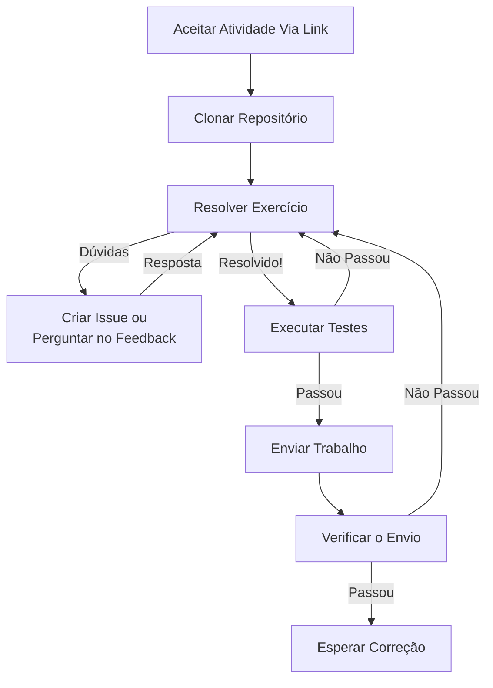

# Instruções Gerais dos Exercícios

Leia atentamente esse documento para saber como resolver os exercícios e enviar seus trabalhos na disciplina.

O fluxograma abaixo mostra o passo a passo para resolver os exercícios e enviar os trabalhos.



Abaixo estão as instruções para cada passo do fluxograma.

## 🤔 Clonar Repositório 🤔

Para resolver os exercícios e realizar os testes você precisa clonar o repositório do exercício.
Para isso você pode usar o [VSCode](https://code.visualstudio.com/) ou o terminal.
Instruções detalhadas sobre o processo de clonagem podem ser encontradas na [documentação do GitHub](https://docs.github.com/pt/repositories/creating-and-managing-repositories/cloning-a-repository?platform=linux&tool=cli).

Caso apareça algum erro durante a clonagem, provavelmente o seu `git` deve estar mal configurado ou não está instalado.
Essa [documentação do GitHub](https://docs.github.com/pt/get-started/quickstart/set-up-git) deve ajudar.

## 🤓 Resolver Exercício 🤓

Siga as instruções específicas do seu exercício para entender o que deve ser feito.
Elas estarão no arquivo `README.md` do repositório do exercício.

## 🤯 Dúvidas 🤯

Caso não consiga resolver o exercício, você pode abrir uma **issue** no repositório do exercício explicando o seu problema.

Você também pode perguntar e descrever seu problema no **pull request** chamado `Feedback` que está no repositório do exercício.

> Lembre-se de marcar o professor e os monitores na sua **issue** ou **pull request** para que eles possam te ajudar.
>
> Pois, eles não são notificados automaticamente.

Caso a dúvida seja específica sobre alguma parte do código [Envie seu Trabalho](#👋-enviar-o-trabalho-👋) para que seja possível ver o que está acontecendo.

Caso precise de um lembrete sobre como funcionam **issues** e **pull requests** você pode encontrar mais informações [aqui sobre issues](https://docs.github.com/pt/issues/tracking-your-work-with-issues/creating-an-issue) e [aqui sobre pull requests](https://docs.github.com/pt/pull-requests/collaborating-with-pull-requests/proposing-changes-to-your-work-with-pull-requests/requesting-a-pull-request-review).

## 🧪 Executar Testes 🧪

Para corrigir os trabalhos e evitar o trabalho maçante de testar manualmente todos os programas, vamos usar testes automáticos para verificar os problemas mais grosseiros.

A ideia é que você não precisa saber como os testes são feitos, mas **precisa saber como executá-los**.

> Um teste automático é um programa que executa o seu programa e verifica se o resultado está de acordo com o esperado.

Existem algumas formas diferentes e equivalentes de testar o seu trabalho **antes** de [Enviar o seu trabalho](#👋-enviar-o-trabalho-👋).
Aqui vou explicar as duas formas mais simples de testar o seu trabalho.

### Formas de Testar o Código

1. caso você esteja usando o [VSCode](https://code.visualstudio.com/), você pode abrir a paleta de comandos `CTRL+SHIFT+P` e digitar `Run All Tests`.

   > Caso não apareça essa opção, você pode instalar a extensão `Python` e reiniciar o `VSCode`.
   > O link para a extensão é [esse](https://marketplace.visualstudio.com/items?itemName=ms-python.python).

   Os testes serão executados e o resultado será mostrado na aba de testes do `VSCode`.
   Um teste que passou é mostrado com um `✅` e um teste que falhou é mostrado com um `❌`.
   Você pode clicar no teste para ver mais detalhes sobre o que aconteceu.

2. executar o módulo `unittest` direto no terminal.
   Para isso, basta executar o seguinte comando no diretório raiz do repositório do exercício:

   ```bash
   python -m unittest
   ```

   Um teste que passou é mostrado com um `.` e um teste que falhou é mostrado com um `F`.
   Caso todos os testes passem, você verá uma mensagem de sucesso parecida com essa:

   ```bash
   ...
   --------------------
   Ran 3 test in 0.003s

   OK
   ```

Para ver como os testes funcionam na prática, você pode clonar esse repositório e executar os testes dele, aproveite para fazer modificações nos arquivos `main.py` e `example_module.py` para ver o que acontece quando eles falham.

### 💣 Erros Comuns 💣

Alguns erros na hora de executar os testes são muito comuns.

#### `ModuleNotFoundError`

Esse erro acontece quando os arquivos não estão nas pastas corretas.

O `main.py` e todos os arquivos escritos ou alterados pelos alunos devem estar no diretório raiz do repositório do exercício.

Os arquivos de teste devem estar na pasta `test` do repositório do exercício.

#### `SyntaxError`

Esse erro acontece quando o código não está escrito corretamente.

#### `IndentationError`

O `Python` é uma linguagem que é sensível a indentação, ou seja, a quantidade de espaços no início de cada linha do código.

#### `TypeError`

Esse erro acontece quando o tipo de dado passado para uma função não é o esperado.
Por exemplo, passar uma `string` para uma função que espera um `int` ou "somar" uma `string` com um `int`.

#### Os testes começam a rodar mas nunca terminam

Tanto no _VSCode_ quanto no terminal, os testes devem terminar em alguns segundos.

Caso os testes nunca terminem, provavelmente o seu programa está em um loop infinito.

#### O _VSCode_ fica procurando os testes sem fim e no terminal o teste nunca _começa_

No caso de testarmos módulos que devem executar apenas declarações de funções como o `example_module.py` esse erro pode acontecer se você fizer algum `input` que será executado quando o módulo for _importado_.

Na hora de importar um módulo, todo o código do módulo é executado, por isso, é importante que o código do módulo não faça `input` ou `print` diretamente.

Caso queira fazer un `input` para testar manualmente seu código, faça ele dentro de um `if __name__ == '__main__':`.

## 👋 Enviar o Trabalho 👋

Agora que possivelmente, você resolveu o exercício e o código passou nos testes, você pode enviar o seu trabalho para ser corrigido.

Claro que no caso de uma dúvida sobre o código do seu programa, você pode enviar o seu trabalho mesmo que ele não passe nos testes.
Pois de outra forma, não seria possível ver o que está acontecendo.

Para enviar o seu trabalho, você precisa fazer um **commit** e um **push** para o repositório do exercício usando o [git](https://git-scm.com/).

Tem pelo menos três formas de fazer isso.
Aqui serão apresentadas as três em ordem da mais simples para a mais complexa.

### Usando o VSCode

No [VSCode](https://code.visualstudio.com/), você pode fazer isso apertando `CTRL+SHIFT+G` para abrir o menu de controle de versão e utilizar a interface gráfica para fazer o **commit** e o **push/sync**.

Uma explicação mais detalhada pode ser vista [aqui](https://code-visualstudio-com.translate.goog/docs/sourcecontrol/overview?_x_tr_sl=af&_x_tr_tl=pt&_x_tr_hl=en&_x_tr_pto=wapp).

### Usando o Terminal

No terminal, você pode fazer isso executando os seguintes comandos no diretório raiz do repositório do exercício:

```bash
git add .
git commit -m "Entrega do exercício"
git push
```

### Usando a interface Web do GitHub

Você pode abrir o repositório do exercício no GitHub e clicar no botão `Add file` e depois em `Upload files` para enviar os arquivos do seu trabalho.

Caso queira algum arquivo, você pode clicar no arquivo que deseja alterar e depois clicar no botão de edição ✏️ (lápis) para fazer as alterações.

Depois de fazer as alterações, você pode clicar no botão `Commit changes` para fazer o **commit**.

## 🔍 Verificando o Envio 🔍

Para verificar se o seu trabalho foi enviado corretamente, você pode abrir o repositório do exercício no GitHub e clicar na aba `Actions` para ver o resultado dos testes.

Na parte `All workflows`, você verá os testes executados do mais recente ao mais antigo.

Se o teste mais recente tiver passado (mostrado com um `✅`), você pode clicar nele para ver mais detalhes.

Caso ele não tenha passado (mostrado com um `❌`), você pode clicar nele para ver mais detalhes e tentar entender o que aconteceu.

> Os testes no github são executados de forma parecida com a forma 2 de executar os testes localmente.
>
> Contudo, os testes no github são executados em um ambiente diferente do seu computador.
> Por isso, é possível que os testes passem no seu computador e falhem no github.
>
> Outra possibilidade é os testes terem sido atualizados e agora estão mais rigorosos.
> Caso essa situação aconteça, você pode entrar em contato com o professor ou monitores para que eles possam te ajudar.

Caso o seu trabalho não passe nos testes, você pode fazer as correções necessárias e enviar novamente.
Contanto que o prazo de entrega não tenha passado, você pode enviar quantas vezes quiser.

> A formatação inadequada e más práticas de programação não são consideradas erros de execução.
> Mas elas serão consideradas na correção do trabalho.
> Testes de formatação também de boas práticas vão ser exibidos como erro na aba `Actions` do GitHub quando o código não estiver de acordo.

## 📝 Correção 📝

A correção do seu trabalho será feita de quase totalmente de forma automática.

O professor e monitores irão verificar se o seu trabalho passou nos testes e se o código está bem escrito.

O código bem escrito é aquele que segue as boas práticas de programação e que é fácil de entender.

Um retorno sobre o estado da correção e sobre as boas práticas de programação será dado na aba `Pull requests` do exercício.

Caso o `Pull request` tenha sido aceito (_Merged_), o seu trabalho foi corrigido e você verá a nota na planilha de notas no sistema da universidade.

### 🥇 Formatação do Código 🥇

Um dos critérios de correção é a formatação do código.

Para formatar o código, você vai usar o [Black](https://black.readthedocs.io/en/stable/) e o [isort](https://pycqa.github.io/isort/) manualmente ou usando o [VSCode](https://code.visualstudio.com/) para fazer isso automaticamente.

> As instruções assumem que o interpretador `python` está no seu `PATH` e que pode ser chamado com o comando `python`.

Para instalar essas ferramentas, você pode executar os seguintes comandos no terminal:

```bash
python -m pip install --user black
python -m pip install --user isort
```

Ou fazer isso via VSCode quando ele pedir.

#### Usando o VSCode

As configurações já estão feitas para usar o `Black` e o `isort` no VSCode.
Para que tudo funcione, você precisa ter o `Black` e o `isort` instalados como também ter as extensões [Black Formatter](https://marketplace.visualstudio.com/items?itemName=ms-python.black-formatter) e [isort](https://marketplace.visualstudio.com/items?itemName=ms-python.isort).

Cada vez que você salvar o arquivo, o VSCode vai formatar o código automaticamente.

#### Manualmente

Para formatar o código via terminal, você pode executar os seguintes comandos no terminal:

```bash
python -m black .
python -m isort --profile black .
```

O comando `python -m black .` vai formatar todo o código do diretório atual.

O comando `python -m isort --profile black .` vai organizar as importações do código do diretório atual.

> O comando `python -m black .` pode levar alguns segundos para executar.

### 🥈 Linting 🥈

Em ingles `linting` no context de programação significa verificar o código em busca de erros ou praticas ruins de programação.

Nas atividades da disciplina, o `linting` é feito usando o [pylint](https://www.pylint.org/).

Para instalar o `pylint`, você pode executar o seguinte comando no terminal:

```bash
python -m pip install --user pylint
```

Para executar o `pylint`, você pode executar o seguinte comando no terminal:

```bash
python -m pylint **/*.py
```

O comando `python -m pylint **/*.py` vai executar o `pylint` em todos os arquivos `.py` do diretório atual e de todos os subdiretórios.

Você também pode utilizar o `pylint` via VSCode.
Para isso, instale a extensão [Pylint](https://marketplace.visualstudio.com/items?itemName=ms-python.pylint).
As configurações já estão feitas para usar o `pylint` no VSCode.
Os erros e avisos do `pylint` serão mostrados no VSCode na aba `problemas` que fica colada no terminal.


## ❗ Observações Importantes ❗

- **Não altere o nome dos arquivos**. Os arquivos `test_main.py` e `main.py` precisam ter esses nomes para que os testes funcionem.
- **Não altere o nome das funções**. Os testes dependem que as funções tenham os nomes especificados no enunciado ou já escritos nos arquivos.
- **Não altere o nome dos parâmetros**. Os testes dependem que as funções tenham os parâmetros especificados no enunciado ou já escritos nos arquivos.
- **Antes de fazer um commit**, execute os testes usando um dos métodos acima para verificar se o seu programa está funcionando corretamente.
- **Caso não consiga corrigir os erros**, entre em contato com o professor ou monitores para que eles possam te ajudar.
  Para isso você deve fazer um commit com o seu trabalho incompleto e abrir uma **issue** no repositório do exercício explicando o seu problema.

## 👀 Curiosidades 👀

O arquivo `requirements.txt` contém uma lista de dependências que o seu programa precisa para funcionar.

No caso da maioria dos exercícios, não é necessário instalar nenhuma dependência.
Pois somente são usadas as bibliotecas padrão do python.

> Quando precisarmos instalar dependências, o comando `pip` é usado para instalar pacotes do python.
> Caso você precise instalar as dependências do seu programa, basta executar o seguinte comando:
>
> ```bash
> python -m pip install --user -r requirements.txt
> ```

O arquivo `Dockerfile` contém as instruções para criar uma imagem do docker com o seu programa.
Isso é útil para que seja possível executar o seu programa em um ambiente controlado e não ter problemas com dependências nem com possível códigos maliciosos na hora de rodar o programa.
São usados dois arquivos `Dockerfile`, um para rodar o seu programa e outro para rodar os testes.

Os arquivos dentro `.vscode` servem para configurar o ambiente de desenvolvimento no [VSCode](https://code.visualstudio.com/).
E facilitar a execução dos testes e do programa.

Os arquivos dentro da pasta `test` são usados para testar o seu programa.

O arquivo `__init__.py` serve para dizer ao python que a pasta `test` é um pacote python.

O arquivo `.gitignore` serve para dizer ao git quais arquivos ele deve ignorar.

O arquivo `.pylintrc` serve para configurar o `pylint`.
